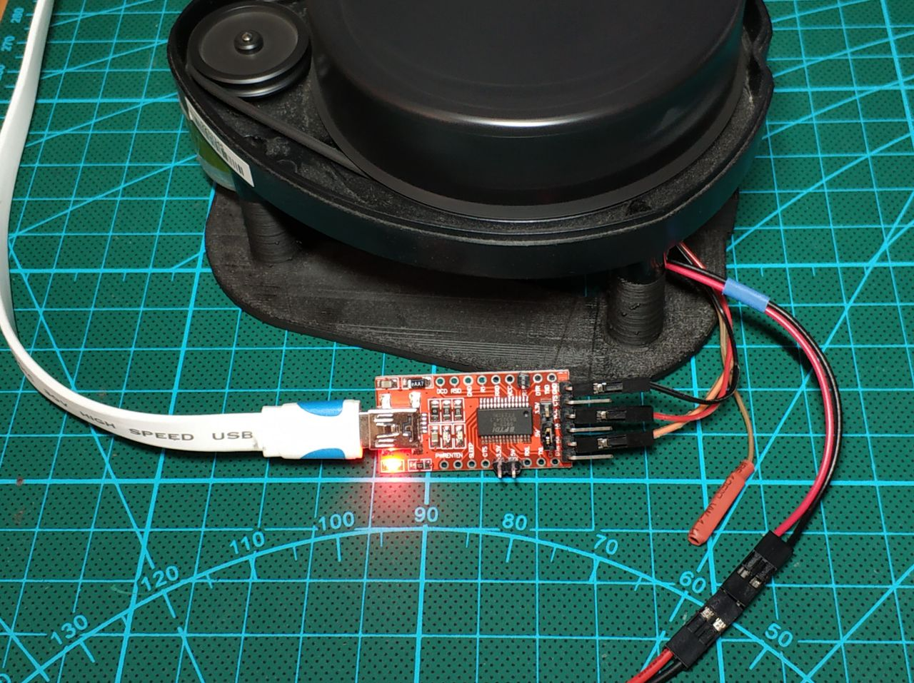
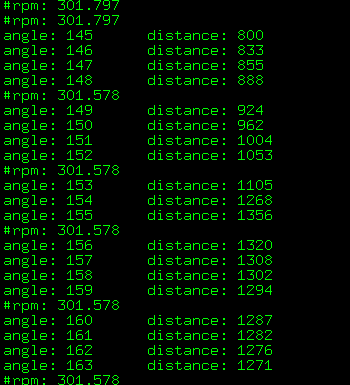

# How to interface the Neato XV11 LIDAR

This is a short documentation for the LIDAR used in the Neato XV11 vacuum robots. 
The actual name of the sensor is Piccolo Laser Distance Sensor, abbreviated into LDS, but many different names are used to refer to it: Neato LDS, Neato lidar, XV-11 lidar, XV-11 sensor...

**N.B.** I am talking about the sensors salvaged from Neato Robotics robots. If you want a snippet that works with the more recent 360 Laser Distance Sensor LDS-01, it is not here.

The LIDAR has two connectors, one for the motor and one for the communication (serial port).
Here is a photo of one of my specimen connected to a PC via a usb-to-serial ftdi dongle:



Note that the `LDS_RX` pin (the brown wire, more on the pinout below) is not used (I do not want to flash the LIDAR and anyways I do not know how to do it).

This repository contains an intentionally short C++ code that reads the steady flow the LIDAR sends to the host.
Here is a screenshot of the output:



I did not want to write any visualization code, this snipped is meant to be used direcly on linux-running robots.
If you want some GUI to test your LIDAR, [check this](https://github.com/Xevel/NXV11) (beware, it requires python2 and vpython 6). A very nice printed base for the LIDAR is available [here](https://www.thingiverse.com/thing:796866/).
Also check for the [USB2LDS](http://www.xevelabs.com/doku.php?id=product:usb2lds:usb2lds) module that guarantees steady motor RPM and provides the usb-to-serial functionality.

## Hardware versions

At least two major hardware versions of the LDS have been seen in the wild. Externally, they look identical, but they differ electrically.
One way to know for sure which one you have is to open the top of the sensor (by removing the 4 screws maintaining the cap, but don't touch
the 6 screws under the unit!) and to have a look at what is written at the pad where the red wire coming from the center is soldered.

**N.B.** In all versions, LDS_TX and LDS_RX are a 8N1 serial port at **3.3V**. The baud rate is 115200.

The connector of the LDS is a JST PH 2.0mm pitch with 4 pins.

### 3.3V powered
Found only in very early units of the XV-11. Sensor power consumption (does not include the motor): ~145mA @ 3.3V

Pinout:
* Red +3.3V
* Brown LDS_RX
* OrangeLDS_TX
* Black GND

### 5V powered

Found in the vast majority of XV-11 units, and all newer models.
Sensor current consumption (does not include the motor): ~45mA idle (not rotating), ~135mA in use (rotating) @ 5V
If powered at 3.3V, you may get data. Or you may get some version information like the following:

```
Terminal ready
:)
Piccolo Laser Distance Scanner
Copyright (c) 2009-2011 Neato Robotics, Inc.
All Rights Reserved

Loader  V2.5.15295
CPU     F2802x/c001
Serial  WTD04513AA-0233345
LastCal [5371726C]
Runtime V2.6.15295
```

Pinout:
* Red +5V
* Brown LDS_RX
* OrangeLDS_TX
* Black GND

**N.B.** Once again, even for the 5V version, LDS_TX and LDS_RX at **3.3V**.

## Motor
The motor has to be driven by the host. In the robot, it's that main board that drives it using PWM from the battery voltage of 12V, as it also controls the speed in closed loop. The motor can be powered at 3.3V continuous ( ~60mA ) in open loop, which will produce a turn rate of around 240rpm on a clean and recent sensor. Hair and dust can however create friction that will lower the rotation speed. Using the turn rate information contained in the data, a closed loop control can be implemented, and is recommended.

Pinout:
* Red PWR
* BlackGND

The connector of the motor is a JST PH 2.0mm pitch with 2 pins.

## Firmware versions

Firmware version can be retrieved by listening to what the sensor says immediately after power-up, or through the robot's API.

### v2.1
Only used in the early 3.3V versions of the hardware (and probably only in these).
Data format is different from the one of following versions.

### v2.4
Used in the 5V and potentially in updated 3.3V versions too (needs confirmation).
Data format is not compatible with v2.1.

### v2.6
Used in the 5V and potentially in updated 3.3V versions too (needs confirmation).
Data format is the same as the one of v2.4.
The menu items and secret menus have changed, and among other things, a little game has been added with the names of the people who did
the reverse engineering as the bosses :D

## Gotchas
* The angle of the data is not aligned with the natural axis of the device. It seems that the first sample of the first packet is in fact looking at
a -10° angle, not 0°. Needs confirmation.
* v2.4 and above: The sensor needs to be turning between 180 and 349 rpm to transmit valid data. Above 349 rpm, the serial interface
becomes the bottleneck and packets will be missing, and blow the lower limit the firmware simply does not send anything. It also seems
that above 320 rpm, data becomes sparse (only one out of two has an actual value).


# Data formats for firmware V2.4 and v2.6
A full revolution will yield 90 packets, containing 4 consecutive readings each.
The length of a packet is 22 bytes.
This amounts to a total of 360 readings (1 per degree) on 1980 bytes.
Each packet is organized as follows:

```
<start> <index> <speed_L> <speed_H> [Data 0] [Data 1] [Data 2] [Data 3] <checksum_L> <checksum_H>
```

where:
* start is always 0xFA
* index is the index byte in the 90 packets, going from 0xA0 (packet 0, readings 0 to 3) to 0xF9 (packet 89, readings 356 to 359).
* speed is a two-byte information, little-endian. It represents the speed, in 64th of RPM (aka value in RPM represented in fixed point, with
6 bits used for the decimal part).
* [Data 0] to [Data 3] are the 4 readings. Each one is 4 bytes long, and organized as follows :
  * `byte 0 : <distance 7:0>`
  * `byte 1 : <"invalid data" flag> <"strength warning" flag> <distance 13:8>`
  * `byte 2 : <signal strength 7:0>`
  * `byte 3 : <signal strength 15:8>`
The distance information is in mm, and coded on 14 bits.The minimum distance is around 15cm, and the maximum distance is around 6m.
When bit 7 of byte 1 is set, it indicates that the distance could not be calculated. When this bit is set, it seems that byte 0 contains an error
code. Examples of error code are 0x02, 0x03, 0x21, 0x25, 0x35 or 0x50...
When it's `21`, then the whole block is `21 80 XX XX`, but for all the other values it's the data block is `YY 80 00 00`...
The bit 6 of byte 1 is a warning when the reported strength is greatly inferior to what is expected at this distance. This may happen when the
material has a low reflectance (black material...), or when the dot does not have the expected size or shape (porous material, transparent
fabric, grid, edge of an object...), or maybe when there are parasitic reflections (glass... ).
Bytes 2 and 3 are the LSB and MSB of the strength indication. This value can get very high when facing a retroreflector.
* checksum is a two-byte checksum of the packet.
The algorithm is as follows, provided that `data` is the list of the 20 first bytes, in the same order they arrived in.

```python
def checksum(data):
    """Compute and return the checksum as an int."""
    # group the data by word, little-endian
    data_list = []
    for t in range(10):
        data_list.append( data[2*t] + (data[2*t+1]<<8) )
    # compute the checksum on 32 bits
    chk32 = 0
    for d in data_list:
        chk32 = (chk32 << 1) + d
    # return a value wrapped around on 15bits, and truncated to still fit into 15 bits
    checksum = (chk32 & 0x7FFF) + ( chk32 >> 15 ) # wrap around to fit into 15 bits
    checksum = checksum & 0x7FFF # truncate to 15 bits
    return int( checksum )
```


